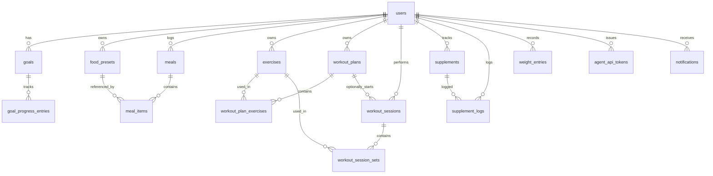

# IronLog D1 Data Model

## Entities

| Entity | Purpose |
|--------|---------|
| `users` | Core identity, preferences, macro targets, soft-delete |
| `goals` | User-defined targets (weight, nutrition, strength, cardio, habit) |
| `goal_progress_entries` | Snapshots tracking progress toward a goal |
| `food_presets` | Reusable foods with nutrition per serving |
| `meals` | A logged meal (breakfast, lunch, snack, etc.) |
| `meal_items` | Individual items inside a meal, linked to a food preset or freeform |
| `exercises` | Reusable exercises (strength, cardio, mobility, sport) |
| `workout_plans` | Routines composed of exercises |
| `workout_plan_exercises` | Exercises within a plan, with day, order, sets/reps/rest |
| `workout_sessions` | A performed workout instance |
| `workout_session_sets` | Per-set results (reps, weight, time, distance, RPE) |
| `supplements` | Recurring supplements with dose/frequency/reminders |
| `supplement_logs` | Each time a supplement was taken |
| `weight_entries` | Weight/body-fat measurements over time |
| `agent_api_tokens` | User-scoped API tokens for agent integrations |
| `notifications` | In-app/user notifications |

## ERD (Mermaid)

## Conventions

- Primary keys are text UUIDs generated at the edge (preferred) or CUIDs.
- Foreign keys use `ON DELETE CASCADE` for child ownership, `SET NULL` for optional references.
- Times are stored as `timestamp_ms` integers from `unixepoch() * 1000`.
- Soft delete on `users` via `deleted_at`; most child rows cascade on user delete.
- Macro totals are stored on `meal_items` so meal aggregates can be computed deterministically.
- Indexes cover every foreign key and common query columns (`logged_at`, `started_at`, `measured_at`, `taken_at`, `read_at`).
- `agent_api_tokens.hashed_secret` stores bcrypt hashes; the plain token is shown only on creation.
